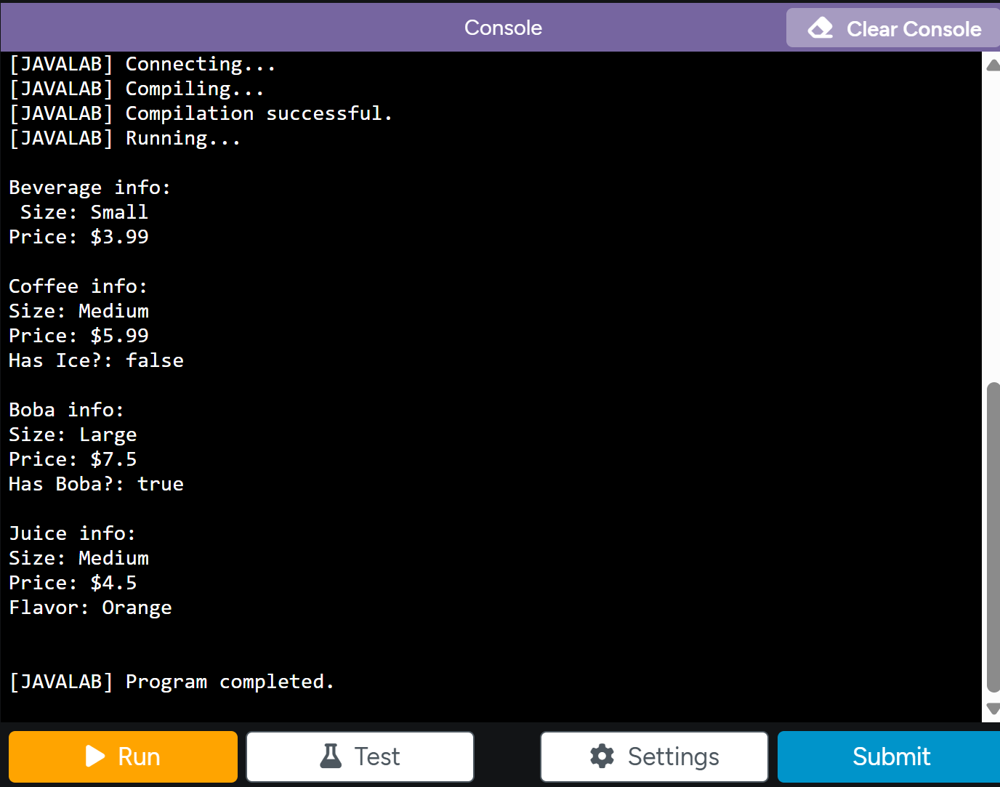

# Store-Management-Project-Karis-Han

# Unit 2 - Store Management Project

## Introduction

You are opening a new business in your community! Businesses often need programs to manage the products and services they offer and track orders and requests from customers. Your goal is to create a store management system for your business.

## Requirements

Use your knowledge of object-oriented programming and class structure and design to create your store management system:
- **Create a class hierarchy** – Develop a superclass that represents a product or service your business offers and one or more subclasses that extend the superclass to represent more specific types of products or services.
- **Declare instance variables** – Declare instance variables in the superclass that are shared with the subclasses and instance variables in the subclasses that are not shared with the superclass.
- **Write constructors** – Write no-argument and parameterized constructors in the superclass and subclasses. Subclass constructors use the super keyword to call the superclass constructor.
- **Implement accessor and mutator methods** – Write accessor and mutator methods for instance variables that should be accessible and/or modifiable from outside of the class.
- **Implement a toString() method** – Write toString() methods in the superclass and subclasses that return information about the state of an object.

## UML Diagram

This is an image of what gets outputted into the console after running the program.

## Description

For my Store Management Project, I created a Beverages Store program because I thought drinks like coffee, boba, and juice would be fun to organize/create classes for. My superclass, Beverages, includes the instance variables price and flavor, which are then inherited by all the other drinks. The subclasses Coffee, Boba, and Juice each extend the superclass and add their own unique instance variable, such as flavor for Juice and hasBoba for Boba. Each class has no-argument and parameterized constructors, and the subclasses use the super keyword to call the Beverages constructor. I also used access and mutator methods so that the instance variables are kept private but can still be accessed/modified, which follows the main principle of encapsulation. Each class also has a toString() method that returns information about the drink.